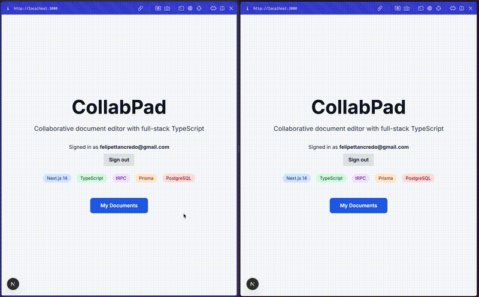

# 📝 CollabPad

> Google-Docs-style real-time Markdown editor built from scratch with CRDTs & full-stack TypeScript.

[](https://github.com/ferecci/collabpad/actions/workflows/ci.yml)
[](LICENSE)
[](#-testing)

<div align="center">
  
</div>

---

## ✨ Features

| Category              |                                                                              |
| --------------------- | ---------------------------------------------------------------------------- |
| **Auth**              | GitHub OAuth via NextAuth.js                                                 |
| **Real-time Editing** | Yjs CRDT over WebSocket, multi-cursor presence, offline conflict-free merges |
| **Type Safety**       | End-to-end tRPC API with Zod validation                                      |
| **Database**          | PostgreSQL + Prisma ORM                                                      |
| **UI**                | TipTap 3 editor, Tailwind CSS theme                                          |
| **DX / CI**           | ESLint, Prettier, Vitest, GitHub Actions matrix (Node 18 & 20)               |
| **Dev Env**           | `docker-compose up -d` spins Postgres + Redis + y-websocket relay            |

---

## 🏗️ Architecture at a Glance

```text
┌───────────────────────────────────────────┐
│                Browser                    │
│┌───────────────┐   ┌─────────────────────┐│
││ TipTap Editor │──▶│ Yjs Doc (CRDT)      ││
│└───────────────┘   └─────────────────────┘│
│               ▲           │ WebSocket      │
└───────────────┼───────────┼────────────────┘
                │           ▼
┌───────────────┴───────────────────────────┐
│        y-websocket Relay (Docker)         │
└───────────────┬───────────────────────────┘
                │ tRPC (HTTP)                   PostgreSQL
┌───────────────┴──────────────────────┐      ┌──────────┐
│        Next.js 14 API Routes         │─────▶│  Prisma  │
│  (tRPC routers, NextAuth callbacks)  │      └──────────┘
└──────────────────────────────────────┘
```

---

## 🛠️ Tech Stack

| Layer    | Tech                             |
| -------- | -------------------------------- |
| Frontend | Next.js 14, React 18, TypeScript |
| Backend  | tRPC, NextAuth.js, Prisma        |
| Database | PostgreSQL                       |
| Realtime | Yjs + y-websocket                |
| Styling  | Tailwind CSS                     |
| Testing  | Vitest                           |
| Dev Ops  | Docker, GitHub Actions           |

---

## 🚀 Getting Started

### Prerequisites

- Node 18+ & pnpm
- Docker & Docker Compose
- GitHub account (for OAuth)

### Quick Start

```bash
git clone https://github.com/ferecci/collabpad.git
cd collabpad
pnpm install

# Spin up Postgres, Redis & y-websocket
docker-compose up -d

# Copy env vars & fill in GitHub creds
cp env.example .env.local
```

Create a GitHub **OAuth App** (Developer Settings → _OAuth Apps_)

- **Homepage URL:** `http://localhost:3000`
- **Authorization callback URL:** `http://localhost:3000/api/auth/callback/github`

Paste the `GITHUB_ID` and `GITHUB_SECRET` into `.env.local` and generate a `NEXTAUTH_SECRET`:

```bash
openssl rand -base64 32
```

Run migrations and start the dev server:

```bash
pnpm db:migrate     # creates tables & generates Prisma client
pnpm dev            # http://localhost:3000
```

---

## 📂 Project Structure

```
collabpad/
├─ src/
│  ├─ app/               # Next.js app-router pages & layouts
│  ├─ components/        # Reusable React components
│  ├─ lib/               # Helpers & utilities
│  ├─ server/            # tRPC routers & NextAuth config
│  └─ types/             # Shared type definitions
├─ prisma/               # Schema & migrations
├─ docker-compose.yml    # Postgres, Redis, y-websocket
└─ vitest.config.ts
```

---

## 🔧 Useful Scripts

| Command           | Purpose                          |
| ----------------- | -------------------------------- |
| `pnpm dev`        | Start dev server with hot-reload |
| `pnpm build`      | Production build                 |
| `pnpm start`      | Start prod server                |
| `pnpm lint`       | Run ESLint + Prettier            |
| `pnpm format`     | Auto-format code                 |
| `pnpm test`       | Run Vitest unit tests            |
| `pnpm type-check` | Run `tsc --noEmit`               |
| `pnpm db:migrate` | Prisma migrate & generate client |
| `pnpm db:studio`  | Launch Prisma Studio GUI         |

---

## 🐳 Docker Cheat-Sheet

```bash
# Spin everything up (detached)
docker-compose up -d

# Tail logs
docker-compose logs -f

# Shut it all down
docker-compose down
```

---

## 🤝 Contributing

Contributions are welcome! Feel free to open an issue or pull request.

---

## 📜 License

MIT © 2025 [ferecci (Felipe Tancredo)](https://github.com/ferecci)
